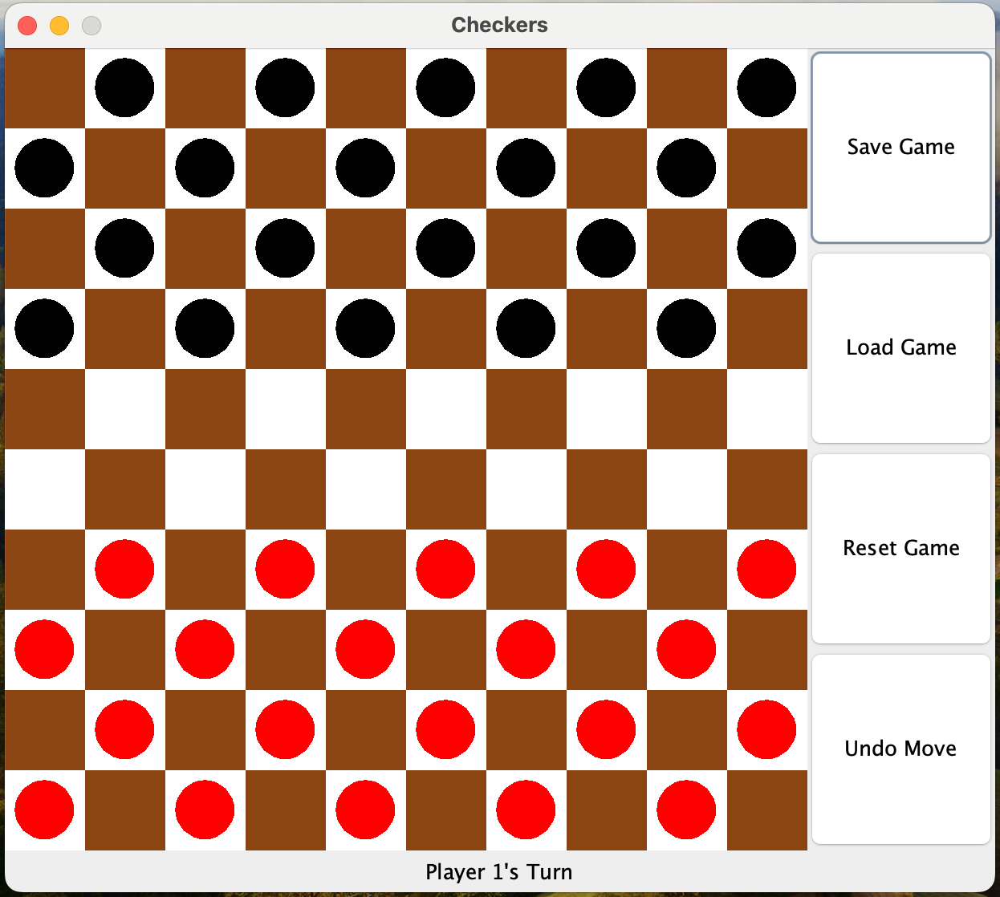

## **Checkers Game**

This project is an implementation of the classic international Checkers game developed using Java and Swift. The game features a comprehensive set of functionalities that includes saving and loading game states, undoing moves, and restarting the game, providing players with a smooth and engaging experience. Key methods within the project are carefully designed to handle game mechanics, such as moving pieces, capturing opponents' pieces, and managing turn-based gameplay. The `Game` class orchestrates the overall flow of the game, while `Piece` and `CheckersBoard` classes handle the intricacies of piece movements and board states.

The game also includes robust features for game state management. The save and load functionalities allow players to save their progress and continue later from where they left off, enhancing the game's usability. The undo feature lets players revert their last move, offering an opportunity to rethink strategies without starting over. Additionally, the restart functionality provides a way to quickly reset the board to its initial state, allowing for a fresh start at any moment.

## **How to Play**

In this Checkers game, players take turns moving their pieces diagonally across the board. When a piece can jump over an opponent's piece, capturing it is mandatory, adhering to the rules of international Checkers. The game assists players by highlighting the cells they can move to, ensuring that they are aware of all possible moves. The objective is to capture all of the opponent's pieces or block them so they cannot make a move. The game ends when a player has no remaining moves or pieces. The intuitive design and clear visual cues make it easy for players to focus on strategy and enjoy the game.
